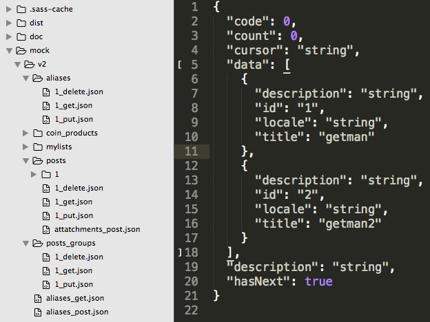

# 백오피스에 새로운 api를 사용한 메뉴 달기

1. Backoffice의 mock>v2 폴더에 스웨거를 참고해서 api mock을 만든다.
    2. (node-easymock.md 문서 참고)
    3. 
2. backoffice.md를 참고해서 메뉴를 단다.
3. shared > service.remote.js에 목데이터와 CRUD를 연결해준다.
```javascript
// ## PostsGroup
postsGroup : function postsGroup() {
    return $resource('http://localhost:3000/v2/posts_groups/:id', {}, {
      update: {method: 'PUT'}
});
},
```

https://code.angularjs.org/1.3.15/docs/api/ngResource/service/$resource\
```javascript
{ 'get':    {method:'GET'},
  'save':   {method:'POST'},
  'query':  {method:'GET', isArray:true},
  'remove': {method:'DELETE'},
  'delete': {method:'DELETE'} };
```
이 angular의 $resource에서 제공하는 기본이므로, 보통 PUT만 추가하거나 이름 바꾸고 싶으면 오버라이드 하기도 한다.
```javascript
page : function page() {
        return $resource(backApi + 'pages/:id', {}, {
          update: {method: 'PUT'}
        });
      }
```

4. postGroup.tpl.html을 알맞게 고쳐준다.
```html
<tr ng-repeat="pageSet in list.data track by $index">
    <td>{{::pageSet.description}}</td>
    <td>{{::pageSet.id}}</td>
    <td>{{::pageSet.locale}}</td>
    <td>{{::pageSet.title}}</td>
    <td><span ng-hide="pageSet.updated ===0">{{::pageSet.updated | lzTime}}</span></td>
    <td>{{::pageSet.created | lzTime}}</td>
    <td>
...
 <div class="form-group">
        <label class="col-sm-2 control-label" for="">Description</label>
        <div class="col-sm-10">
          <input type="text" name="description" class="form-control" ng-model="newData.description" placeholder="설명글">
        </div>
      </div>
      <div class="form-group">
        <label class="col-sm-2 control-label" for="">Id</label>
        <div class="col-sm-10">
          <input type="text" name="id" class="form-control" ng-model="newData.id" placeholder="PostsGroup의 이름">
        </div>
      </div>
```

5. postsGroup.js
```javascript
//데이터도 알맞게 넘겨주고
pageSet = _.pick(pageSet, ['description', 'id', 'locale', 'title']);
...

//서비스에서 만들어준 크루드 리소스도 제대로 넘겨준다.
//id가 없으면 제대로 못가져올때도 있으니 주의.
Remote.backend.postsGroup(),
```

### lodash pick
https://lodash.com/docs#pick
