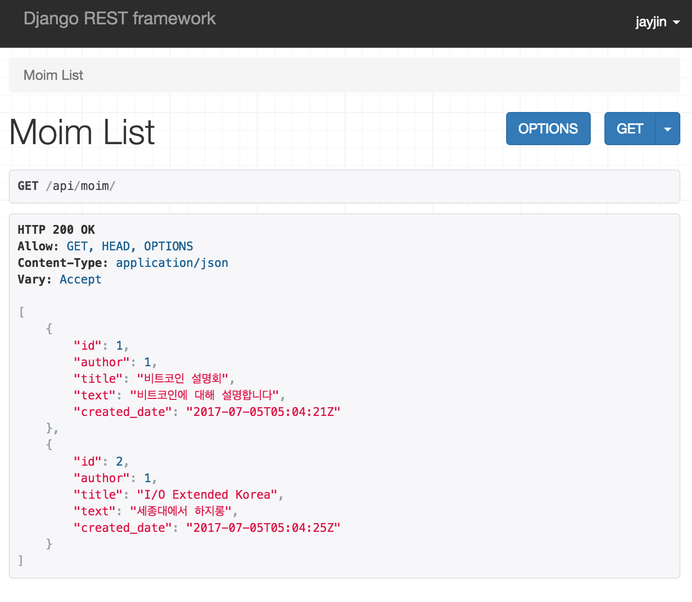

# React와 Django Rest Framework로 웹 서비스 세팅하기 (feat. webpack, Redux, React Router)

## 사용 버전
- Python: 3.4.3
- Django: 1.11.3
- Django Rest Framework: 3.6.3

## Django Rest Framework 세팅
API 서버로 사용할 DRF를 설치.

#### 가상환경, 장고 세팅
프로젝트 폴더에 가상환경을 세팅하고 장고를 설치한다 [참고: 장고걸스 튜토리얼](https://tutorial.djangogirls.org/ko/django_installation/)
```shell
$ python3 -m venv venv #venv라는 이름의 가상환경 생성
$ vi .env # .env파일 만든다. source venv/bin/activate 적어주고 저장
$ pip install django # 장고 설치
$ pip install djangorestframework # DRF 설치
$ django-admin startproject mogae . # 현재 폴더에 mogae라는 장고 프로젝트 만들기
```

```python
# requirements.txt
Django==1.11.3
djangorestframework==3.6.3
```

[장고걸스 튜토리얼](https://tutorial.djangogirls.org/ko/django_start_project/) 참고해서 장고 앱을 만든다.
메인 장고 앱인 `mogae`와 API 서버로 쓸 `api`를 만들었다.

#### mogae/settings.py
```
INSTALLED_APPS = (
    ...
    'rest_framework',
    'mogae',
    'api',
)
REST_FRAMEWORK = {
    'DEFAULT_PERMISSION_CLASSES': [
        'rest_framework.permissions.DjangoModelPermissionsOrAnonReadOnly'
    ]
}
```

#### mogae/urls.py
```python
from django.conf.urls import url, include
from django.contrib import admin
from django.views.generic import TemplateView

urlpatterns = [
    url(r'^$', TemplateView.as_view(template_name='index.html'),
        name='index'),
    url(r'^api/', include('api.urls')),
    url(r'^admin/', admin.site.urls),
    url(r'^api-auth/', include('rest_framework.urls', namespace='rest_framework')) # login, logout 등 사용
]
```

#### mogae/models/moim.py
```python
from __future__ import unicode_literals

from django.db import models
from django.utils import timezone


# 간단한 모임 모델 구성
class Moim(models.Model):
    author = models.ForeignKey('auth.User')
    title = models.CharField(max_length=200)
    text = models.TextField()
    created_date = models.DateTimeField(
            default=timezone.now)

    def __str__(self):
        return self.title

```

### mogae/models/__init__.py
init파일에 모델을 명시해두면 다른 파일에서 `from mogae.models import (Moim, Others)`로 심플하게 import 할 수 있다.
```python
from mogae.models.moim import Moim
```

### mogae/admin.py
Admin에 Moim 모델 등록
```python
from django.contrib import admin

from mogae.models.moim import Moim

admin.site.register(Moim)
```

### api/urls.py
```python
from django.conf.urls import url

from .views import MoimListView

urlpatterns = [
    url(r'^moim/$', MoimListView.as_view(), name='moim'),
]
```

### api/views/moim.py
```python
from rest_framework import generics, serializers
from rest_framework.response import Response

from mogae.models import Moim


# 모임 리스트 시리얼라이저. api에서 보여줄 필드 명시
class MoimListSerializer(serializers.ModelSerializer):

    class Meta:
        model = Moim
        fields = ('id', 'author', 'title', 'text', 'created_date')


# api/moim 으로 get하면 이 listview로 연결
class MoimListView(generics.ListAPIView):
    queryset = Moim.objects.all()
    serializer_class = MoimListSerializer

    def list(self, request):
        queryset = self.get_queryset()
        serializer_class = self.get_serializer_class()
        serializer = serializer_class(queryset, many=True)

        page = self.paginate_queryset(queryset)
        if page is not None:
            serializer = self.get_serializer(page, many=True)
            return self.get_paginated_response(serializer.data)

        return Response(serializer.data)
```

### api/views/__init__.py
이 init도 역시 다른 파일에서 `from mogae.models import (Moim, Others)`로 심플하게 import하기 위함
```python
from api.views.moim import *
```

### api 잘 불러지는지 확인

```shell
$ ./manage.py createsuperuser # superuser 만들기. admin 로그인 가능.
$ ./manage.py makemigrations # 마이그레이션 파일 생성
$ ./manage.py migrate # DB에 마이그레이션 파일 적용
$ ./manage.py runserver # 서버 열기
```

`http://localhost:8000/admin/mogae/moim/`에서 모임 몇 개를 만들고,
`http://localhost:8000/api/moim/`로 접속하면 모임 리스트 API가 GET되는 것을 볼 수 있다.



## React 세팅
create react app은 명령어로 간단히 react app을 세팅할 수 있는 facebook 공식 프로젝트다.
Webpack 이나 babel 등을 따로 설정하지 않고 사용할 수 있다(node_modules 폴더 안에 숨겨져 있다. 이를 꺼내려면 eject)
```shell
$ npm install -g create-react-app # 글로벌로 cra 설치
$ create-react-app app # cra로 app이라는 리액트 앱 만들기
$ cd app
$ npm start
```

` http://localhost:3001/`에 들어가면 react 앱을 볼 수 있다.


### 8000번 포트의 django rest api 3000번 포트의 리액트에서 접근하기
`app/package.json` 하단에 proxy를 사용해 `localhost:8000`의 `/api`에 접속할 수 있도록 해준다.
```json
{
  ...
  "proxy": {
    "/api": {
      "target": "http://localhost:8000"
    }
  }
}
```

> CSS가 깨지는데 무방. Bootstrap과 jQuery를 넣으면 깨지지 않는다.
