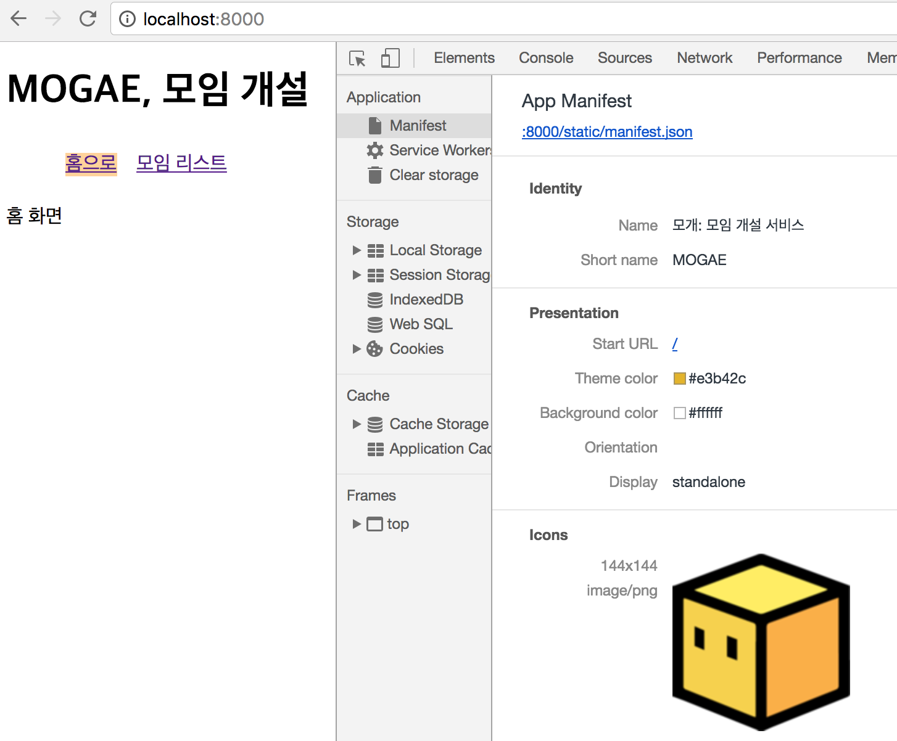
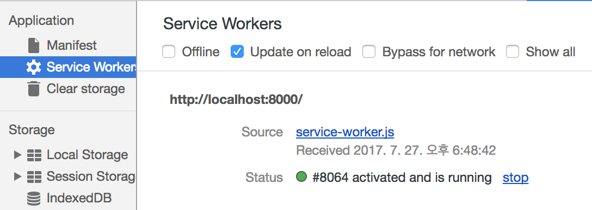

# [서버부터 프론트까지] React와 Django로 웹 서비스 뚝딱 세팅하기 (feat. Webpack, Redux, django rest framework, PWA)

## 목표
모임 개설 사이트, 'MOGAE' 제작.
`Django`에 `Django Rest Framework`를 얹어 API 서버를, `react`로 프론트엔드를 개발합니다.
상태관리는 `redux`로 하며 `Progressive Web App`기술을 적용해 앱처럼 사용할 수 있습니다.

이를 연동하여 온전한 웹 어플리케이션을 만드는 것에 초점을 맞춘 튜토리얼입니다.
(기술에 대한 설명은 하지 않습니다.)

## 사용 버전
- Python: 3.4.3
- Django: 1.11.3
- Django Rest Framework: 3.6.3

## Django Rest Framework 세팅
API 서버로 사용할 DRF를 설치.

#### 가상환경, 장고 세팅
프로젝트 폴더에 가상환경을 세팅하고 장고를 설치한다 [참고: 장고걸스 튜토리얼](https://tutorial.djangogirls.org/ko/django_installation/)
```shell
$ python3 -m venv venv # venv라는 이름의 가상환경 생성
$ source venv/bin/activate # 가상환경 실행
$ pip install django # 장고 설치
$ pip install djangorestframework # DRF 설치
$ django-admin startproject mogae . # 현재 폴더에 mogae라는 장고 프로젝트 만들기
```

`pip install -r requirements.txt`
```python
# requirements.txt
Django==1.11.3
djangorestframework==3.6.3
```

[장고걸스 튜토리얼](https://tutorial.djangogirls.org/ko/django_start_project/) 참고해서 장고 앱을 만든다.
메인 장고 앱인 `mogae`와 API 서버로 쓸 `api`를 만들었다.

#### mogae/settings.py
```
INSTALLED_APPS = (
    ...
    'rest_framework',
    'mogae',
    'api',
)
REST_FRAMEWORK = {
    'DEFAULT_PERMISSION_CLASSES': [
        'rest_framework.permissions.DjangoModelPermissionsOrAnonReadOnly'
    ]
}
```

#### mogae/models/moim.py
```python
from __future__ import unicode_literals

from django.db import models
from django.utils import timezone


# 간단한 모임 모델 구성
class Moim(models.Model):
    author = models.ForeignKey('auth.User')
    title = models.CharField(max_length=200)
    text = models.TextField()
    date = models.DateTimeField()
    thumbnail = models.ImageField(u'썸네일', 
                        upload_to='%Y/%m/%d', blank=True, null=True)
    join_users = models.ManyToManyField('auth.User', 
                        verbose_name=u'참석', blank=True, 
                        related_name='join_moim')
    created_date = models.DateTimeField(default=timezone.now)

    def __str__(self):
        Moim.objects.filter(date__lte=timezone.now())\
                    .order_by('created_date')
        return self.title

from django.contrib import admin
from mogae.models.moim import Moim

admin.site.register(Moim) # Moim모델을 Admin에 등록

```

### mogae/models/__init__.py
init파일에 모델을 명시해두면 다른 파일에서 `from mogae.models import (Moim, Others)`로 심플하게 import 할 수 있다.
```python
from mogae.models.moim import Moim
```

### mogae/migratons/__init__.py
이 파일을 만들어주고
terminal에서 `./manage.py makemigrations`를 해 주면 migrations파일이 만들어진다.


### mogae/admin.py
Admin에 Moim 모델 등록
```python
from django.contrib import admin

from mogae.models.moim import Moim

admin.site.register(Moim)
```

### api/urls.py
```python
from django.conf.urls import url

from .views import MoimListView

urlpatterns = [
    url(r'^moim/$', MoimListView.as_view(), name='moim'),
]
```

### api/views/moim.py
```python
from rest_framework import generics, serializers
from rest_framework.response import Response

from mogae.models import Moim


# 모임 리스트 시리얼라이저. api에서 보여줄 필드 명시
class MoimListSerializer(serializers.ModelSerializer):

    class Meta:
        model = Moim
        fields = ('id', 'author', 'title', 'text', 'created_date')


# api/moim 으로 get하면 이 listview로 연결
class MoimListView(generics.ListAPIView):
    queryset = Moim.objects.all()
    serializer_class = MoimListSerializer

    def list(self, request):
        queryset = self.get_queryset()
        serializer_class = self.get_serializer_class()
        serializer = serializer_class(queryset, many=True)

        page = self.paginate_queryset(queryset)
        if page is not None:
            serializer = self.get_serializer(page, many=True)
            return self.get_paginated_response(serializer.data)

        return Response(serializer.data)
```

### api/views/__init__.py
이 init도 역시 다른 파일에서 `from mogae.models import (Moim, Others)`로 심플하게 import하기 위함
```python
from api.views.moim import *
```

### api 잘 불러지는지 확인

```shell
$ ./manage.py createsuperuser # superuser 만들기. admin 로그인 가능.
$ ./manage.py makemigrations # 마이그레이션 파일 생성
$ ./manage.py migrate # DB에 마이그레이션 파일 적용
$ ./manage.py runserver # 서버 열기
```

`http://localhost:8000/admin/mogae/moim/`에서 모임 몇 개를 만들고,
`http://localhost:8000/api/moim/`로 접속하면 모임 리스트 API가 GET되는 것을 볼 수 있다.


---

## React 세팅
create react app은 명령어로 간단히 react app을 세팅할 수 있는 facebook 공식 프로젝트다.
Webpack 이나 babel 등이 리액트 프로젝트에 맞게 미리 세팅되어있다(node_modules 폴더 안에 숨겨져 있다. 이를 꺼내려면 eject)
```shell
$ npm install -g create-react-app # 글로벌로 cra 설치
$ create-react-app app # cra로 app이라는 리액트 앱 만들기
$ cd app
$ npm start
```

` http://localhost:3000/`에 들어가면 react 앱을 볼 수 있다.


### 8000번 포트의 django rest api 3000번 포트의 리액트에서 접근하기
`app/package.json` 하단에 proxy를 사용해 `localhost:8000`의 `/api`에 접속할 수 있도록 해준다.
```json
{
  ...
  "proxy": {
    "/api": {
      "target": "http://localhost:8000"
    }
  }
}
```

> CSS가 깨지는데 무방. Bootstrap과 jQuery를 넣으면 깨지지 않는다.

---

## React + Redux + React Router
모임 리스트를 보여주는 간단한 Single Page Application 을 만든다.

```shell
app
├── README.md
├── package.json
├── node_modules
├── public
│   ├── favicon.ico
│   └── index.html
├── src
│   ├── App.test.js
│   ├── actions
│   │   └── index.js
│   ├── components
│   │   ├── App.js
│   │   ├── Home.js
│   │   └── Moim.js
│   ├── containers
│   │   └── MoimList.js
│   ├── index.css
│   ├── index.js
│   ├── logo.svg
│   ├── reducers
│   │   ├── index.js
│   │   └── reducer_lists.js
│   ├── registerServiceWorker.js
│   ├── static
│   │   └── styles
│   │       └── App.less
│   └── store
│       ├── configureStore.dev.js
│       ├── configureStore.js
│       └── configureStore.prod.js
└── yarn.lock
```


### index.js
`provider`로 전체 앱에 `store`를 주입해주고, `history`를 설정해서 라우터로 들어간 페이지에서 새로고침 해도 원하는 곳을 갈 수 있도록 한다.

```html
import React from 'react';
import ReactDOM from 'react-dom';
import { Provider } from 'react-redux'
import App from './components/App';
import configureStore from './store/configureStore'
import createHistory from 'history/createBrowserHistory';
import { Router, Route } from 'react-router-dom';


const store = configureStore();

ReactDOM.render(
  <Provider store={store}>
    <Router history={createHistory()}>
      <Route path="/" component={App}/>
    </Router>
  </Provider>,
  document.getElementById('root')
);
```

### components/App.js
라우팅을 해주는 컴포넌트. NavLink를 넣어주고 원하는 url별로 보여줄 component를 Switch로 감싼다.
```html
import React, { Component } from 'react';
import { NavLink, Route, Switch } from 'react-router-dom'
import Home from './Home'
import MoimList from '../containers/MoimList'

class App extends Component {
  render() {
    return (
      <div className="App">
        <div className="App-header">
          <h1>MOGAE, 모임 개설</h1>
        </div>
        <div className="content-wrapper">
          <ul>
            <li><NavLink exact to="/">홈으로</NavLink></li>
            <li><NavLink to="/moim">모임 리스트</NavLink></li>
          </ul>
        <Switch>
          <Route exact path="/moim" component={MoimList}/>
          <Route exact path="/" component={Home}/>
        </Switch>
      </div>
      </div>
    );
  }
}

export default App;
```

### actions/index.js
우리가 만든 `/api/moim`을 get해오는 액션을 만든다.
```js
import axios from 'axios'
export const FETCH_MOIM = 'FETCH_MOIM';

export function fetchMoim() {
  const request = axios.get('/api/moim/');
  return {
    type: FETCH_MOIM,
    payload: request
  }
}
```

### reducers/index.js
`combineReducers`로 우리가 사용할 리듀서들을 묶어 `rootReducer`로 export한다.
```js
import { combineReducers } from 'redux';
import ListsReducer from './reducer_lists';
import { reducer as formReducer } from 'redux-form'

const rootReducer = combineReducers({
  lists: ListsReducer,
  form: formReducer
});
export default rootReducer;
```

### reducers/reducer_lists.js
`FETCH_MOIM`액션이 불렸을 때 데이터를 `moimList`에 저장해 새로운 state를 반환해준다.
```js
import { FETCH_MOIM } from '../actions/index';

const initialState = {
    moimList: [],
};


export default function (state = initialState, action) {
    switch(action.type) {
        case FETCH_MOIM:
            return { ...state, moimList: action.payload.data };
        default:
            return state;
    }
}
```

### components/Home.js, Moim.js
홈 화면, 모임 데이터를 보여주는 `presentational Component`를 만든다.
```html
// Home.js
import React from 'react'

export default function() {
  return (
    <div>
      홈 화면
    </div>
  )
}

// Moim.js
import React from 'react';


export default ({ moimData }) => {
  return (
    <div>
      {moimData.title}
    </div>
  );
}
```

### containers/MoimList.js
컴포넌트가 만들어지고 javascript 렌더링을 마치면 `this.props.fetchMoim()` 액션으로 api로부터 데이터를 가져와 `state.list.moimList`에 저장한다.
이를 전에 만든 `Moim.js` 컴포넌트를 map으로 돌려 리스트의 모든 모임 데이터를 뿌려준다.
```html
import React, { Component } from 'react';
import { connect } from 'react-redux';
import Moim from '../components/Moim';
import { fetchMoim } from '../actions/index';

class MoimList extends Component {
  componentDidMount() {
    this.props.fetchMoim();
  }

  renderMoim () {
    return this.props.moimList.map((moim) => {
      return <li key={moim.id}><Moim moimData={moim}/></li>;
    });
  }

  render () {
    return (
      <div>
        <h2>모임 리스트</h2>
        <ul>
          {this.renderMoim()}
        </ul>
      </div>
    );
  }
}

export default connect((state) => {
  return {
    moimList: state.lists.moimList
  };
}, { fetchMoim })(MoimList);
```

'홈으로', '모임 리스트' 네비게이션 링크를 누르면 url과 컨텐츠가 바뀌는 것을 볼 수 있다.


### 스타일 적용(less-loader)
`LESS`(CSS pre-processor)를 사용해서 스타일을 적용할 것이다.
`create-react-app`이 기껏 webpack setting 파일을 숨겨주었지만(node_modules 내부에 있음)
우리는 여기서 커스텀 세팅을 더 하기 위해 (app 폴더)`$ npm run eject`명령어로 세팅 파일을 빼낸다.

명령어를 치면 app 폴더 하위에 `config`, `scripts`폴더가 생기고 `package.json`파일도 더 복잡해진다.

```shell
$ npm install --save less less-loader
```

`webpack.config.dev.js`의 exclude에 `less`를 추가하고, 그 아래 `STOP` 하단에 `less-loader`를 추가해준다. (`webpack.config.prod.js`에도 동일하게 해 준다.)
```json
    // ** ADDING/UPDATING LOADERS **
  // The "file" loader handles all assets unless explicitly excluded.
  // The `exclude` list *must* be updated with every change to loader extensions.
  // When adding a new loader, you must add its `test`
  // as a new entry in the `exclude` list for "file" loader.

  // "file" loader makes sure those assets get served by WebpackDevServer.
  // When you `import` an asset, you get its (virtual) filename.
  // In production, they would get copied to the `build` folder.
  {
    exclude: [
    /\.html$/,
    /\.(js|jsx)$/,
    /\.(css|less)$/,
    /\.json$/,
    /\.bmp$/,
    /\.gif$/,
    /\.jpe?g$/,
    /\.png$/,
    ],
    loader: require.resolve('file-loader'),
    options: {
      name: 'static/media/[name].[hash:8].[ext]',
  },
},

...

  // ** STOP ** Are you adding a new loader?
  // Remember to add the new extension(s) to the "file" loader exclusion list.
  {
   test: /\.less$/,
   use: [
     'style-loader',
     'css-loader',
     'less-loader',
   ]
 },
```

`static/styles/App.less` 파일을 만들어 `active`클래스를 가진 li의 배경색을 바꾸는 내용을 추가한다.
```css
li {
  display: inline-block;
  margin: 0.5rem;
  a.active {
    background: #ffd29b;
  }
}
```

이제 `App.js`에서 less를 직접 import할 수 있다.
```html
<!-- 상단에 추가 -->
import '../static/styles/App.less';
```


제작 완료! 이제 배포를 위해 빌드를 해 보자.

---

## Webpack build
실 서버에서는 웹팩 빌드의 결과물인 `build/index.html`를 장고 urls.py에서 template폴더로 접근해 사용할 것이다.

app폴더에서 `npm run build` 명령어로 빌드를 돌리면 `app/build`폴더에 아래와 같은 파일이 생긴다.
```shell
/build
├── asset-manifest.json
├── favicon.ico
├── index.html
├── manifest.json
├── service-worker.js
└── static
    ├── css
    │   ├── main.d41d8cd9.css
    │   └── main.d41d8cd9.css.map
    └── js
        ├── main.8a4490cb.js
        └── main.8a4490cb.js.map
```
`app/public`에 있는 파일들이 `build`폴더의 루트에 복사되고, 
지금까지 webpack-dev-server로 빌드해서 사용하고 있었던 javascript와 css파일들이 하나로 묶여 해쉬값 붙은 이름으로 `static`폴더 내에 생긴다.
이 파일들은 웹팩이 `index.html`에 알아서 추가해줘 우리는 `index.html`만 바로 사용하면 된다.
(`service-worker.js`는 `SWPrecacheWebpackPlugin` 웹팩 플러그인이 만들어준 파일이다. 추후에 설명)


#### settings.py
```
TEMPLATES = [
    {
        'BACKEND': 'django.template.backends.django.DjangoTemplates',
        'DIRS': [
            'app/build',
        ],

...
STATICFILES_DIRS = [
    str(root.path("app/build/static")),
]
```
`TEMPLATES`에 `app/build`폴더를 추가하면 장고에서 이 폴더 내부에 있는 것들을 template파일로 접근할 수 있다.
`STATICFILES_DIRS`에 `app/build/static`폴더를 추가하면 `127.0.0.1:8000/static/img_url.png`와 같이 자원에 바로 접근할 수 있다.

#### mogae/urls.py
기본 `/` url을 `index.html`에 연결해준다.
`/moim/`이나 `/home/` url로 바로 접근하더라도 장고가 index.html 로 보내줄 수 있게 추가한 url도 적어준다.
```python
from django.conf.urls import url, include
from django.contrib import admin
from django.views.generic import TemplateView

urlpatterns = [
    url(r'^$', TemplateView.as_view(template_name='index.html'),
        name='index'),
    url(r'^api/', include('api.urls')),
    url(r'^admin/', admin.site.urls),
    url(r'^api-auth/', include('rest_framework.urls', namespace='rest_framework')) # login, logout 등 사용,
    url(r'^(home)|(moim)/', TemplateView.as_view(template_name='index.html'), name='route')
]
```

`webpack-dev-server`로 띄운 웹에선 `bundle.js`를 사용하는 반면
`python server`로 띄운 웹에선 `main.f1fd535b.js`를 사용하는 것을 볼 수 있습니다.


이렇게...
Django + React 앱 제작 완료!


---

## Progressive Web App

마지막으로 네이티브 앱과 같은 사용자 경험을 주는 웹앱을 목표로 하는 `Progressive Web App(PWA)`를 설정해 봅니다.
`create-react-app`에서 이미 다 세팅해주었기 때문에 몇 가지만 더 하면 됩니다.

#### index.html
route를 해 주는 index.html에 'registerServiceWorker'를 import한 뒤
하단에서 실행해줍니다.
```js
...
import registerServiceWorker from './registerServiceWorker';
...

registerServiceWorker();
```
`registerServiceWorker`가 하는 역할은 배포 상황일 때만 `navigator.serviceWorker.register()`로 브라우저에 서비스워커를 등록해 주는 것입니다.
우리는 서비스워커를 통해 브라우저 자원들을 캐시해서 오프라인에서도 볼 수 있게 하거나 홈스크린에 아이콘을 추가할 수 있습니다.
서비스워커에 대한 자세한 설명은 [여기](https://developers.google.com/web/fundamentals/getting-started/primers/service-workers?hl=ko)를 참고해 주세요.

#### static/assets/
```
assets
├── favicon.ico
├── icon-144x144.png
├── icon-192x192.png
├── icon-512x512.png
└── manifest.json
```

`static` 폴더 안에 `assets`폴더를 만들고, `favicon.ico`과 `144x144`, `192x192`, `512x512`크기의 아이콘을 만들어줍니다.
이는 webpack build시에 `build/static/`폴더로 복사해 줄 것입니다.
`public` 폴더에 넣으면 `build`폴더에 바로 옮겨 주는데 이렇게 하지 않은 이유는

`index.html`에서 `manifest.json`을 url로 접근해야 하며, manifest파일에서 icon url이 필요하기 때문입니다.
`settings.py`에서 `build/static/`폴더를 스태틱으로 지정해두었기 때문에 이 폴더 내부에 있는 파일만 url dispatch 없이 바로 접근할 수 있습니다.

#### manifest.json
```json
{
  "short_name": "MOGAE",
  "name": "모개: 모임 개설 서비스",
  "icons": [
    {
      "src": "./icon-144x144.png",
      "sizes": "144x144",
      "type": "image/png"
    },
    {
      "src": "./icon-192x192.png",
      "sizes": "192x192",
      "type": "image/png"
    },
    {
      "src": "./icon-512x512.png",
      "sizes": "512x512",
      "type": "image/png"
    }
  ],
  "start_url": "/",
  "display": "standalone",
  "theme_color": "#e3b42c",
  "background_color": "#ffffff"
}
```
웹 앱에 대한 설명인 manifest파일을 작성해줍니다.
아까 추가한 icon을 넣어주고, 
홈스크린에 추가된 아이콘으로 들어왔을 때 가장 먼저 보여줄 화면(`start_url`)을 지정합니다.
다른 설정을 통해 위에 주소창을 숨길 것인지, 시작 화면을 가로로 할 지 등을 지정할 수 있습니다.

매니페스트에 대한 자세한 설명은 [여기](https://developers.google.com/web/fundamentals/engage-and-retain/web-app-manifest/?hl=ko)를 참고해 주세요.

#### webpack.config.prod.js
`$ npm install --save copy-webpack-plugin`명령어로 `copy-webpack-plugin`을 설치합니다. 빌드시 특정 파일/폴더를 빌드 폴더로 복사해주는 기능을 합니다.

`webpack.config.prod.js`의 `plugins`를 보면 `SWPrecacheWebpackPlugin`가 이미 세팅되어 있을것입니다. `create-react-app`의 친절이죠.

오프라인 웹앱을 위해 우리는 필요한 파일을 캐싱해야하는데, 웹팩은 빌드 결과물에 해쉬값이 달려 나와 우리가 static하게 이 이름을 참조할 수 없죠.
이 플러그인을 사용하면 필요한 자원 이름을 알아서 찾아 `service-worker.js`파일을 만들어줍니다.

이 아래에 `CopyWebpackPlugin`을 세팅해봅시다.
`./src/static/assets/`폴더를 `static/`에 복사할 거라고 적어줍니다.

```json
const CopyWebpackPlugin = require('copy-webpack-plugin');
...

/* 서비스워커에서 사용할 manifest파일에서 캐싱할 파일들 웹팩 해시값 달아서 service-worker.js를 만든다 */
    new SWPrecacheWebpackPlugin({
      dontCacheBustUrlsMatching: /\.\w{8}\./,
      filename: 'service-worker.js', // 서비스 워커로 사용할(to be)이름
      logger(message) {
        if (message.indexOf('Total precache size is') === 0) {
          return;
        }
        if (message.indexOf('Skipping static resource') === 0) {
          return;
        }
        console.log(message);
      },
      minify: true,
      navigateFallback: publicUrl + '/index.html',
      navigateFallbackWhitelist: [/^(?!\/__).*/],
      staticFileGlobsIgnorePatterns: [/\.map$/, /asset-manifest\.json$/],
    }),
    /* /src/static/assets에 있는 파일들을 build/static으로 옮겨서 manifest에서 사용한다 */
    new CopyWebpackPlugin([
      { from: './src/static/assets/', to: 'static/' },
    ], {
      copyUnmodified: true
    }),
```

#### public/index.html
```html
<!doctype html>
<html lang="en">
  <head>
    ...
    <link rel="manifest" href="/static/manifest.json">
    <link rel="shortcut icon" href="/static/favicon.ico">
    ...
  </head>
  ...
</html>
```
`index.html`에 manifest와 favicon을 넣어줍니다. 

#### urls.py
service worker파일은 index.html과 동일한 폴더(혹은 상위 폴더)에 있어야 제대로 작동합니다.
그래서 `build/static`폴더 안에 넣어서 바로 접근할 수가 없죠.
이를 위해 장고의 `urls.py`에 `service-worker.js`파일을 동일한 이름의 url로 연결해줍니다.
같은 방식으로 `index.html`도 해주는데, 이는 서비스 워커가 오프라인 웹앱을 위해 캐싱할 때 `./index.html`라는 상대 경로(url)로 접근하기 때문에 이도 열어주어야 합니다.

```
...
url(r'^index.html/$',
        TemplateView.as_view(template_name='index.html'), name='index_html'),
url(r'^service-worker.js$',
        TemplateView.as_view(template_name='service-worker.js',
                             content_type='application/javascript'), name='service-worker_js'),
...
```

`npm run build` 명령어로 빌드 후 파이썬 서버로 웹을 띄웁니다.


네트워크 탭에서 `service-worker.js`파일이 잘 불려지고, `index.html`을 캐싱하는 걸 볼 수 있습니다.


어플리케이션 탭에선 manifest파일이 읽혀서 앱의 정보와 icon이 나옵니다.


`service worker`도 열심히 일하고 있네요.


'offline'체크박스를 클릭하고 리프레시 해 보면 오프라인 상태인데도 앱이 잘 보이는 걸 확인할 수 있습니다.


이는 `Cache Storage`에 sw-precache란 이름으로 필요한 자원들을 모두 캐싱해두었기 때문이죠.

